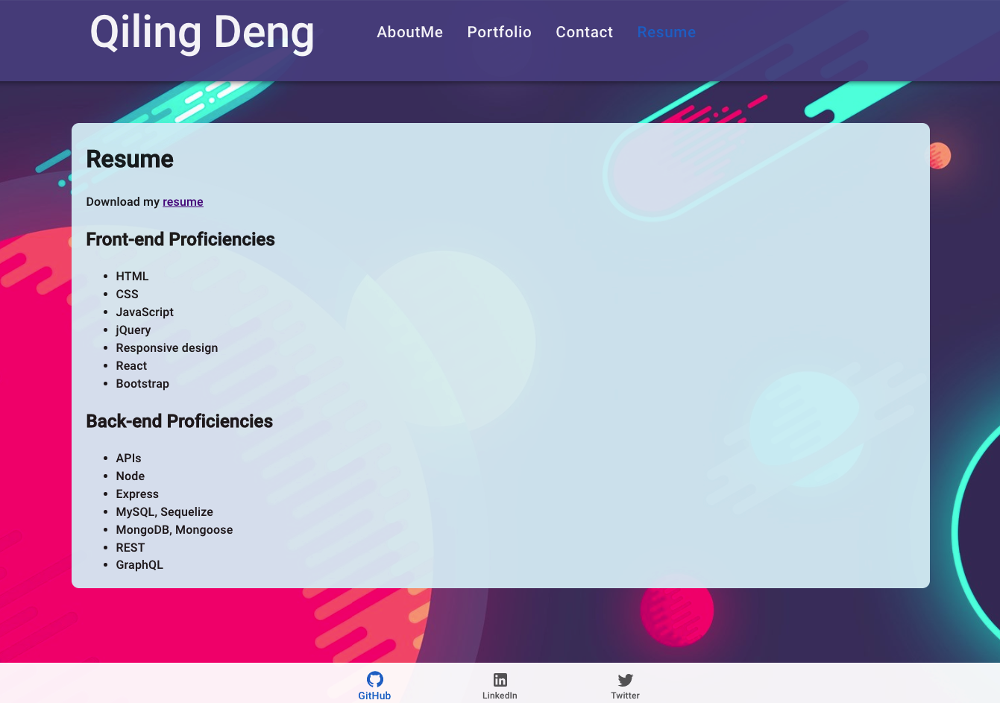
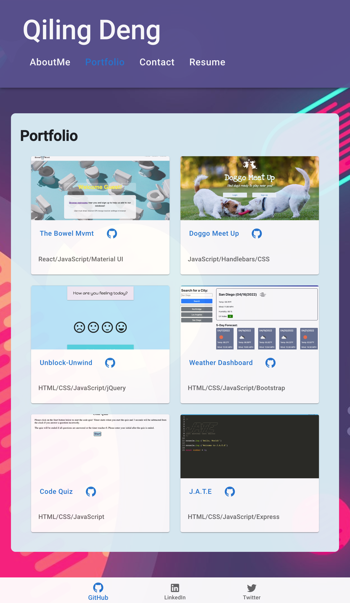

# My Personal Portfolio


## Link

### Please click [here](https://qd9069.github.io/react_my_portfolio/) to find the deployed project.

## Table of Contents 

- [Link](#link)
- [Description](#description)
- [Installation](#installation)
- [Usage](#usage)
- [Technologies](#technologies)
- [Assets](#assets)
- [License](#license)


## Description

Welcome to my personal portfolio page!

In this webpage, you will see projects and work applications that I have been developed and deployed. My contact information and link for my resume have been included in this portfolio page.

Please feel free to reach out if you have any questions or comments regarding my portfolio webpage or other projects!

## Installation

**For users** - no installation needed, please visit the deployed [application link](https://qd9069.github.io/react_my_portfolio/) directly

**For developers** - use the following commands in root folder
- To install npm packages: `npm i`
- To install [Material UI](https://mui.com/material-ui/getting-started/overview/) (if needed): `npm install @mui/material @emotion/react @emotion/styled`
- To start the app: `npm start`
- To stop the app: `Control+C` then close your terminal

## Usage

- **Navigation Bar**: Click on one of the buttons (`AboutMe`, `Portfolio`, `Contact`, and `Resume`) in the navigation bar, the UI will bring user to the corresponding section.
    - `Portfolio`: Click on the title of the projects, user will be taken to that deployed application.
        - Click on the GitHub icon next to the project title, user will be redirected to the GitHub Repo page for that project.
    - `Contact`:
        - Fill out the **Contact Me** form to leave me a message, OR
        - View my contact information below the **Contact Me** form
    - `Resume`: The `resume` link will redirect user to view a downloadable PDF of my resume
- **Bottom Navigation**
    - Click on the `GitHub` icon to visit my GitHub profile page
    - Click on the `LinkedIn` icon to visit my LinkedIn profile page
    - Click on the `Twitter` icon to visit my Twitter profile page

## Technologies

```md
- HTML
- CSS
- JavaScript
- React / Create React App
- Material UI
```

## Assets

The following images demonstrate the web application's appearance and functionality:

**About Me**


**Portfolio**


**Contact**


**Resume**


**Mobile**:


**Tablet**:


**Desktop**:


## License

Copyright (c) 2022 Elaine D. Released under the MIT [License](./LICENSE).

---
Code originally by QD 2022 🏆 
